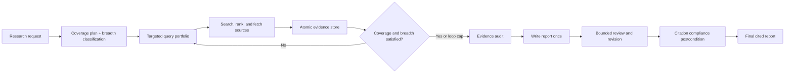

# Evidence-First AI Research Agent

[](https://github.com/adityasankranthi/AI-research-agent/actions/workflows/ci.yml)


[](https://huggingface.co/spaces/muset-ai/DeepResearch-Bench-Leaderboard)

**[Try the AI agent locally—no API keys required →](#try-it-yourself)** ·
**[Launch the Web UI →](#try-the-web-ui)** ·
**[Inspect the benchmark artifacts →](benchmark_results/)**

An AI web-research agent that plans what to investigate, searches for independent
support, preserves claims as atomic evidence, audits coverage, and writes a cited report
only when the evidence is ready.

## Table of contents

- [Overview](#overview)
- [Metrics at a glance](#metrics-at-a-glance)
- [Benchmark results](#benchmark-results)
  - [Live leaderboard comparison](#live-leaderboard-comparison)
  - [Why a bigger model was not the answer](#why-a-bigger-model-was-not-the-answer)
- [How we improved report quality](#how-we-improved-report-quality)
- [What the experiments taught us](#what-the-experiments-taught-us)
- [Architecture](#architecture)
- [Try it yourself](#try-it-yourself)
  - [Run locally without API keys](#run-the-ai-agent-locally-without-api-keys)
  - [Try the Web UI](#try-the-web-ui)
- [Evaluation and reproducibility](#evaluation-and-reproducibility)
- [Project structure](#project-structure)
- [Acknowledgments](#acknowledgments)

## Overview

This project was built from scratch in plain Python—without an agent orchestration
framework—and improved through measured experiments on
[DeepResearch Bench](https://github.com/Ayanami0730/deep_research_bench), a real external
benchmark of PhD-level research tasks.

The agent can:

- turn an open-ended question into a coverage plan;
- generate targeted search portfolios instead of one generic query;
- rank, fetch, deduplicate, and retain evidence from multiple sources;
- enforce minimum evidence breadth before broad research can stop;
- synthesize the report once, after research, to avoid summary-of-summary information loss;
- repair or remove citations that fail deterministic compliance checks; and
- run with hosted AI models or locally through Ollama.

## Metrics at a glance

**[Run it locally →](#try-it-yourself)** or **[use the Web UI →](#try-the-web-ui)**

| Metric | Final measured result | What it demonstrates |
|---|---:|---|
| GPT-5.5 RACE | **43.13** | Inside the current published top-10 score band |
| FACT citation validity | **90.80%** | 9 in 10 evaluated citation instances were supported |
| Valid citations per report | **32.76** | Exactly **2×** the 16.38 pre-planner baseline |
| Paired architecture gain | **+5.86 RACE / +15.7%** | Same 12 tasks, model, backend, and judge |
| Full-run completion | **50/50 English tasks** | Zero failed agent reports |
| Regression suite | **127 tests passing** | Model, search, fetch, and API boundaries mocked |

> **Benchmark scope:** 43.13 is a 50-English-task result, not an official bilingual
> leaderboard submission. It places the project in the published top-10 score band; it
> does not establish an official rank.

## Benchmark results

The central result is an engineering result: **changing the agent architecture improved
quality more reliably than changing to a larger model.**

| Experiment | Controlled evaluation scope | Measured result |
|---|---:|---:|
| Citation-precision baseline | 50 English benchmark tasks | 35.50 RACE / 91.1% FACT / 16.38 valid citations |
| Evidence-first architecture | Fixed 12-task paired set | **37.29 → 43.15 RACE** |
| Broad-question stopping rule | Official task-56 evaluation | **45.74 → 49.57 RACE** |
| Breadth-aware citation validation | Official task-56 FACT evaluation | **100% accuracy, 18 effective citations** |
| Automated regression suite | Mocked model, search, fetch, and API boundaries | **127 tests passing** |

On the fixed development set, planning, atomic evidence, and write-once synthesis raised
RACE by **5.86 points / 15.7%** with the same
`openrouter/anthropic/claude-haiku-4-5` model and Tavily search backend.

### Live leaderboard comparison

[Open the live DeepResearch Bench leaderboard →](https://huggingface.co/spaces/muset-ai/DeepResearch-Bench-Leaderboard)

*Comparison checked 16 July 2026 from the official leaderboard Space CSV.*

The final architecture was evaluated with the same **GPT-5.5 RACE judge** used by the
current leaderboard. Its 43.13 average falls inside the published top-10 score band:

| Score-band comparison | GPT-5.5 RACE | Scope |
|---|---:|---|
| Published rank 8 — OpenAI Deep Research | **47.84** | Full bilingual benchmark |
| **This AI agent — final architecture** | **43.13** | 50 English tasks |
| Published rank 9 — Perplexity Research | **43.05** | Full bilingual benchmark |
| Published rank 10 — Grok Deeper Search | **41.22** | Full bilingual benchmark |

Numerically, this agent is **0.08 points above the published rank-9 score** and 1.91
points above the current top-10 cutoff. That is a score-band comparison, not a claimed
official rank: our run covers the benchmark's 50 English tasks, while leaderboard
submissions cover the complete English-and-Chinese suite.

The current GPT-5.5 table does not publish FACT values. Against the FACT values still
listed in the legacy table, this run's **90.80% citation validity** is 3.48 points above
the highest displayed result, 87.32%. This is also only a numerical comparison because
the evaluator generation and task scope differ.

> **Scope, stated plainly:** 43.13 RACE / 90.80% FACT is the final 50-English-task run;
> 35.50 RACE / 91.1% FACT is the 50-task pre-planner baseline under the earlier evaluator;
> 43.15 is a paired 12-task architecture experiment; and 49.57 RACE / 100% FACT is a
> single-task ablation. The project claims a top-10 **score band**, not an official rank.

### Why a bigger model was not the answer

Before redesigning the pipeline, a three-task ablation tested Claude Sonnet with much
larger retrieval limits. It did not beat the simpler Haiku configuration.

| Configuration | Model | Loop cap | Results/query | Output budget | RACE (0–1) |
|---|---|---:|---:|---:|---:|
| Default | Claude Haiku 4.5 | 4 | 5 | 2,048 | **0.38** |
| More model + more retrieval | Claude Sonnet 5 | 12 | 8 | 2,048 | 0.25 |
| More model + matched output budget | Claude Sonnet 5 | 12 | 8 | 6,144 | 0.37 |

The first Sonnet run gathered far more material but compressed it into the same
2,048-token report ceiling. Its reports became shorter—305–833 words versus 945–1,230
for the default—and RACE fell. Raising the report budget recovered the loss, but still
did not establish a win over Haiku.

This was only an n=3 ablation, so it does not prove that smaller models are generally
better. It proves something more useful for this project: **model scale cannot compensate
for a mismatched research and synthesis pipeline.** The repeatable 12-task improvement
came from architecture while the model stayed fixed.

## How we improved report quality

### 1. Planning and atomic evidence improved every RACE dimension

The same 12 prompts (DeepResearch Bench IDs 51–62), model, search backend, and official
judge were used before and after replacing the iterative summary-rewrite loop with the
evidence-first pipeline.

| RACE dimension | Iterative pipeline | Evidence-first pipeline | Gain |
|---|---:|---:|---:|
| Comprehensiveness | 36.86 | **41.76** | +4.90 |
| Insight | 36.27 | **42.54** | +6.27 |
| Instruction following | 39.02 | **44.23** | +5.20 |
| Readability | 38.40 | **45.47** | +7.07 |
| **Overall** | **37.29** | **43.15** | **+5.86** |

The agent now stores source-backed claims rather than repeatedly rewriting a running
summary. It audits the evidence and synthesizes once at the end. The largest gain was
readability—even though the final reports retained more evidence—because useful detail
was no longer degraded through repeated compression.

### 2. Minimum evidence breadth fixed premature stopping

Task 56 asks for a general method for solving asymmetric first-price auctions. The first
deep version considered one supported plan item sufficient and stopped after one loop.
The revised agent classified the question as broad and required at least two loops, five
retained evidence URLs, and three source domains before early stopping was allowed.

| Task-56 metric | Citation-compliant one-loop run | Breadth-aware run |
|---|---:|---:|
| Research loops | 1 | **2** |
| Gathered sources | 9 | **19** |
| Report words | 529 | **1,496** |
| Inline citations | 3 | **20** |
| Unique cited URLs | 3 | **10** |
| Cited domains | 2 | **10** |
| Agent cost | $0.0234 | $0.0804 |
| Official RACE | 45.74 | **49.57** |

The breadth-aware report also beat the original deep task-56 score of 47.53. Official
FACT extracted 21 citation instances across 11 URLs: all **18 evaluable citations were
supported**, while three were marked unknown and excluded by the benchmark. The result
was **100% citation accuracy and 18.0 effective citations**.

### 3. Evidence depth doubled while citation precision stayed near 91%

The final 50-task run shows what the architecture changed at scale:

| 50-English-task run | RACE | Citations/report | Valid citations/report | FACT validity |
|---|---:|---:|---:|---:|
| Iterative pre-planner baseline | 35.50 | 17.98 | 16.38 | **91.1%** |
| **Final evidence-first architecture** | **43.13** | **36.08** | **32.76** | **90.80%** |

The final agent produced exactly **2× as many valid citation instances per report** while
holding citation validity within 0.3 percentage points of the precision-focused baseline.
Because the RACE and FACT judge generations changed between these two full runs, this
table is descriptive rather than a causal paired comparison. The controlled 12-task
experiment above—same prompts, model, backend, and judge—is the evidence that attributes
the quality gain to architecture.

The full run also clarifies the earlier 100% result: **100% FACT belonged only to the
task-56 breadth ablation**. Across all 50 English tasks, the final measured citation
validity is **90.80%**.

Raw evidence is available in [`benchmark_results/`](benchmark_results/), including the
[final 50-task reports](benchmark_results/deep-full-50-final.jsonl),
[GPT-5.5 RACE result](benchmark_results/deep-full-50-final-race-gpt55/race_result.txt),
[GPT-5.4-mini FACT result](benchmark_results/deep-full-50-final-fact-gpt54mini/fact_result.txt),
[12-task RACE output](benchmark_results/deep-dev-12-race.jsonl),
[task-56 combined metrics](benchmark_results/deep-dev-56-breadth-metrics.json), and
[official FACT output](benchmark_results/deep-dev-56-breadth-fact/fact_result.txt).

## What the experiments taught us

- **Store evidence, not evolving prose.** Atomic claims survive many search rounds;
  repeatedly rewriting a report discards detail and compounds summarization errors.
- **Coverage needs a mechanical definition.** Every plan item needs independent support
  before it can be considered researched.
- **Broad questions need global breadth constraints.** Plan-item completion can be
  fooled by an under-decomposed plan, so broad tasks also require multiple loops, URLs,
  and source domains.
- **Citation quality should be a postcondition.** The final report is checked for unknown
  URLs and evidenced plan items that were never cited. One bounded repair is allowed,
  followed by a deterministic fallback.
- **Retrieval, context, and output budgets must scale together.** More loops and sources
  hurt quality when the final report budget remained fixed.
- **Benchmark the system, not just the model.** Keeping the model fixed made it possible
  to attribute the 15.7% gain to agent design rather than model substitution.

The complete methodology, failed experiments, and reproducible commands are documented
in [`docs/deepresearch-bench.md`](docs/deepresearch-bench.md).

## Architecture



The project keeps two modes behind the same model and tool interfaces, making controlled
experiments possible:

| Mode | Design | Best use |
|---|---|---|
| `iterative` | Query → search → summarize → reflect | Fast, lower-cost research |
| `deep` | Plan → evidence → audit → write → citation check | Benchmark-quality reports |

## Try it yourself

Requires Python 3.10+ and [`uv`](https://github.com/astral-sh/uv).

```bash
git clone https://github.com/adityasankranthi/AI-research-agent.git
cd AI-research-agent
uv sync --extra dev
cp .env.example .env
```

### Run the AI agent locally without API keys

With [Ollama](https://ollama.com/) installed and running, use a local model and
DuckDuckGo search:

```bash
ollama pull qwen2.5:7b

uv run research-agent \
  --topic "What are the strongest approaches to scalable ion-trap quantum computing?" \
  --model ollama/qwen2.5:7b \
  --research-mode deep
```

### Try the Web UI

The FastAPI + React interface runs the same agent and streams planning, search, and
report progress with Server-Sent Events.

```bash
# Terminal 1 — API
uv run uvicorn api.main:app --reload --port 8000

# Terminal 2 — UI
cd web
npm install
npm run dev
```

Open `http://localhost:5173`, open **Settings**, and provide the model-provider and
search keys required by your selected configuration. Keys remain in browser local
storage and are passed through only for the active request; the server does not persist
them.

| Ask a question | Watch the research | Inspect the cited report |
|---|---|---|
|  |  |  |

<details>
<summary><strong>Hosted-model example and CLI options</strong></summary>

```bash
uv run research-agent \
  --topic "Compare the evidence for the leading approaches to this problem" \
  --model openrouter/anthropic/claude-haiku-4-5 \
  --search-backend tavily \
  --research-mode deep \
  --fetch-full-page \
  --output report.md \
  --trajectory trajectory.json
```

| Flag | Default | Description |
|---|---|---|
| `--topic` | required | Research request |
| `--research-mode` | `iterative` | `iterative` or `deep` |
| `--model` | `ollama/qwen2.5:7b` | Any LiteLLM-compatible model string |
| `--search-backend` | `duckduckgo` | `duckduckgo` or `tavily` |
| `--loops` | `3` | Research-loop safety cap |
| `--max-search-results` | `3` | Search results retained per query |
| `--fetch-full-page` | off | Replace snippets with fetched page text |
| `--output` | unset | Write the final Markdown report |
| `--trajectory` | unset | Write state, evidence, sources, calls, and cost |

Every `Config` field is also available as a
`RESEARCH_AGENT_<FIELD_NAME>` environment variable. Broad-task thresholds default to
two loops, five evidence URLs, and three source domains.

</details>

<details>
<summary><strong>Production build and Docker</strong></summary>

```bash
cd web && npm ci && npm run build
cd ..
uv run uvicorn api.main:app --host 0.0.0.0 --port 8000
```

Or run the multi-stage container:

```bash
docker build -t research-agent .
docker run -p 8000:8000 research-agent
```

</details>

## Evaluation and reproducibility

<details>
<summary><strong>Tests, internal evaluation, and DeepResearch Bench workflow</strong></summary>

### Fast regression suite

```bash
uv run pytest -q
```

**127 tests pass** with model, search, fetch, and API boundaries mocked. The suite takes
about two seconds and makes no live network calls.

### Internal evaluation

```bash
uv run research-agent-eval \
  --model openrouter/anthropic/claude-haiku-4-5 \
  --search-backend tavily \
  --judge keyword
```

The six-topic internal set is a cheap regression signal. Use `--judge llm` with a
separate judge model for semantic grading.

### DeepResearch Bench

The adapter writes the JSONL format expected by the upstream benchmark:

```bash
uv run research-agent-bench \
  --query-file /path/to/deep_research_bench/data/prompt_data/query.jsonl \
  --output /path/to/deep_research_bench/data/test_data/raw_data/research-agent.jsonl \
  --model openrouter/anthropic/claude-haiku-4-5 \
  --search-backend tavily \
  --ids 51,52,53,54,55,56,57,58,59,60,61,62 \
  --concurrency 3
```

Scoring remains in the benchmark's own repository so RACE and FACT are neither
reimplemented nor approximated here. See the
[benchmark guide](docs/deepresearch-bench.md) for the complete two-repository workflow.

</details>

## Project structure

```text
research_agent/
├── agent.py                 # Mode dispatch and iterative research loop
├── deep_research.py         # Coverage-driven evidence-first pipeline
├── deep_prompts.py          # Planner, query, evidence, audit, and review schemas
├── citation_compliance.py   # Final citation postcondition and repair
├── source_quality.py        # Deterministic authority and relevance ranking
├── state.py                 # Plans, evidence, sources, and research state
├── llm.py                   # Provider-independent AI model client
├── search.py                # DuckDuckGo and Tavily backends
├── fetch.py                 # Full-page extraction
├── grounding.py             # Gathered-source citation checks
├── config.py                # Runtime knobs and environment resolution
└── cli.py                   # research-agent command

eval/
├── run_eval.py              # Internal evaluation harness
└── deepresearch_bench.py    # DeepResearch Bench adapter

api/                         # FastAPI + SSE backend
web/                         # React + Vite frontend
tests/                       # Network-mocked test suite
benchmark_results/           # Raw measured outputs committed for inspection
```

## Acknowledgments

This project uses **DeepResearch Bench**, created by Mingxuan Du, Benfeng Xu, Chiwei
Zhu, Xiaorui Wang, and Zhendong Mao. Their open benchmark, expert-written task set, and
RACE/FACT evaluation pipeline made it possible to test this AI agent against an external
standard instead of relying on subjective demos.

- [DeepResearch Bench repository](https://github.com/Ayanami0730/deep_research_bench)
- [Paper: *DeepResearch Bench: A Comprehensive Benchmark for Deep Research Agents*](https://arxiv.org/abs/2506.11763)
- [Live leaderboard](https://huggingface.co/spaces/muset-ai/DeepResearch-Bench-Leaderboard)

If you use this project's benchmark artifacts, please also cite the DeepResearch Bench
paper as requested by its authors.

## License

MIT — see [LICENSE](LICENSE).
