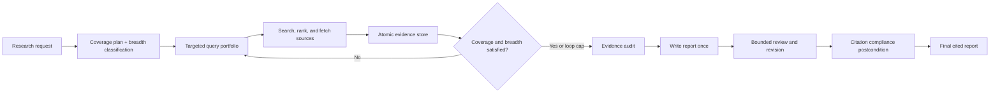

# research-agent

An evidence-first web-research agent that plans what to investigate, searches for
independent support, retains atomic evidence, and writes a cited report only after its
coverage has been audited.

It is deliberately built without an orchestration framework: the planner, research
loop, evidence store, stopping rules, reviewer, and citation checks are plain Python and
measured against a real external benchmark.

## Results

| Experiment | Scope | Result |
|---|---:|---:|
| Citation-precision baseline | 50 English DeepResearch Bench tasks | **91.1% FACT citation accuracy** |
| Evidence-first architecture | Fixed 12-task paired development set | **37.29 → 43.15 RACE** |
| Breadth-aware research | Official task-56 RACE evaluation | **47.53 → 49.57 RACE** |
| Breadth-aware citation validation | Official task-56 FACT evaluation | **100% accuracy, 18 effective citations** |

The central result is not that a larger model solved the problem. Every run above used
`openrouter/anthropic/claude-haiku-4-5` with Tavily. Changing the research architecture
raised RACE by **5.86 points / 15.7%** on the fixed development set, while deterministic
citation controls preserved high precision.

### 1. Planning and atomic evidence raised report quality

The same 12 DeepResearch Bench prompts (IDs 51–62), model, search backend, and official
RACE judge were used before and after replacing the iterative summary-rewrite loop with
the evidence-first pipeline.

| RACE dimension | Iterative pipeline | Evidence-first pipeline | Gain |
|---|---:|---:|---:|
| Comprehensiveness | 36.86 | **41.76** | +4.90 |
| Insight | 36.27 | **42.54** | +6.27 |
| Instruction following | 39.02 | **44.23** | +5.20 |
| Readability | 38.40 | **45.47** | +7.07 |
| **Overall** | **37.29** | **43.15** | **+5.86** |

The pipeline improved every judged dimension. The largest gain was readability, despite
the new reports retaining more evidence, because the agent now synthesizes once at the
end instead of repeatedly compressing summaries of summaries.

### 2. Minimum evidence breadth fixed premature stopping

Task 56 asks for a general method for solving asymmetric first-price auctions. The first
deep version treated one supported plan item as complete and stopped after one loop. The
breadth-aware version classified the question as broad and required at least two loops,
five retained evidence URLs, and three source domains before allowing an early stop.

| Task-56 metric | Citation-compliant one-loop run | Breadth-aware run |
|---|---:|---:|
| Research loops | 1 | **2** |
| Gathered sources | 9 | **19** |
| Report words | 529 | **1,496** |
| Inline citations | 3 | **20** |
| Unique cited URLs | 3 | **10** |
| Cited domains | 2 | **10** |
| Agent cost | $0.0234 | $0.0804 |
| Official RACE | 45.74 | **49.57** |

The breadth-aware report also beat the original deep task-56 score of 47.53. Official
FACT extracted 21 citation instances across 11 URLs: all **18 evaluable citations were
supported**, while three were marked unknown and excluded by the benchmark. That yields
**100% citation accuracy and 18.0 effective citations** for this task.

### 3. Citation precision was already strong at 50-task scale

Before the planner existed, the original iterative pipeline completed all 50 English
DeepResearch Bench tasks with:

| Metric | Result |
|---|---:|
| RACE overall | 35.50 |
| Average citations per report | 17.98 |
| Effective citations per report | 16.38 |
| **FACT citation accuracy** | **91.1%** |

That run established the project's precision baseline, but its low RACE score also made
the limitation clear: trustworthy citations do not automatically produce a complete,
insightful report. The new architecture targets that missing depth. The 50-task score is
kept labeled as a **pre-planner baseline** until the current pipeline completes a new
full run.

In the public-leaderboard snapshot recorded for this experiment, **91.1% was higher than
every reported FACT citation-accuracy result; the next highest was 87.3%**. Because the
project run covers 50 English tasks rather than the full bilingual set, this is presented
as a precision comparison—not a new leaderboard rank.

> Benchmark scope matters: the full baseline covers 50 English tasks; 43.15 is a paired
> 12-task development result; 49.57 RACE / 100% FACT is a single-task ablation. None is
> presented as a new full-leaderboard submission.

Raw results are stored under [`benchmark_results/`](benchmark_results/), including
the [12-task RACE output](benchmark_results/deep-dev-12-race.jsonl),
[task-56 combined metrics](benchmark_results/deep-dev-56-breadth-metrics.json), and
[official FACT output](benchmark_results/deep-dev-56-breadth-fact/fact_result.txt).

## What the experiments taught us

- **Store evidence, not evolving prose.** Atomic claims survive many search rounds;
  repeatedly rewriting a report discards detail and compounds summarization errors.
- **Coverage needs a mechanical definition.** Every plan item must have independent
  support before it is considered researched.
- **Broad questions need global breadth constraints.** Plan-item completion alone can be
  fooled by an under-decomposed plan, so broad tasks also require multiple loops, URLs,
  and source domains.
- **Citation quality must be a postcondition.** The final report is checked for unknown
  URLs and for evidenced plan items that were never cited; one bounded repair is allowed,
  followed by a deterministic fallback.
- **More retrieval is not automatically better.** Raising loop and search caps without
  raising the output-token budget made RACE worse in an earlier ablation because more
  material was compressed into the same report ceiling.

The full methodology, failed experiments, and commands are documented in
[`docs/deepresearch-bench.md`](docs/deepresearch-bench.md).

## Architecture



There are two explicit modes:

| Mode | Design | Best use |
|---|---|---|
| `iterative` | Query → search → summarize → reflect | Cheap, fast research |
| `deep` | Plan → evidence → coverage audit → report → citation check | Benchmark-quality reports |

Both modes use the same provider interface and tools, which makes direct experiments
possible without conflating a model change with an architecture change.

## Quick start

Requires Python 3.10+ and [`uv`](https://github.com/astral-sh/uv).

```bash
git clone https://github.com/adityasankranthi/AI-research-agent.git
cd AI-research-agent
uv sync --extra dev
cp .env.example .env
```

Run locally with Ollama and DuckDuckGo—no API keys required:

```bash
uv run research-agent \
  --topic "What are the strongest approaches to scalable ion-trap quantum computing?" \
  --model ollama/qwen2.5:7b \
  --research-mode deep
```

Run the benchmark configuration with a hosted model and Tavily:

```bash
uv run research-agent \
  --topic "Compare the evidence for the leading approaches to this problem" \
  --model openrouter/anthropic/claude-haiku-4-5 \
  --search-backend tavily \
  --research-mode deep \
  --fetch-full-page \
  --output report.md \
  --trajectory trajectory.json
```

Common options:

| Flag | Default | Description |
|---|---|---|
| `--topic` | required | Research request |
| `--research-mode` | `iterative` | `iterative` or `deep` |
| `--model` | `ollama/qwen2.5:7b` | Any LiteLLM-compatible model string |
| `--search-backend` | `duckduckgo` | `duckduckgo` or `tavily` |
| `--loops` | `3` | Research-loop safety cap |
| `--max-search-results` | `3` | Search results retained per query |
| `--fetch-full-page` | off | Replace snippets with fetched page text |
| `--output` | unset | Write the final Markdown report |
| `--trajectory` | unset | Write state, evidence, sources, calls, and cost |

Every `Config` field is also available as a
`RESEARCH_AGENT_<FIELD_NAME>` environment variable. Broad-task thresholds default to
two loops, five evidence URLs, and three source domains.

## Web UI

The FastAPI + React interface uses the same agent and streams progress with Server-Sent
Events. It is bring-your-own-key: provider and Tavily keys stay in browser local storage
and are passed through for the active request rather than written by the server.

| Ask | Watch the research | Inspect the report |
|---|---|---|
|  |  |  |

```bash
# Terminal 1
uv run uvicorn api.main:app --reload --port 8000

# Terminal 2
cd web
npm install
npm run dev
```

Open `http://localhost:5173`.

<details>
<summary><strong>Production build and Docker</strong></summary>

```bash
cd web && npm ci && npm run build
cd ..
uv run uvicorn api.main:app --host 0.0.0.0 --port 8000
```

Or run the multi-stage container:

```bash
docker build -t research-agent .
docker run -p 8000:8000 research-agent
```

</details>

## Evaluation

### Fast regression suite

```bash
uv run pytest -q
```

**127 tests pass** with model, search, fetch, and API boundaries mocked. The suite takes
about two seconds and makes no live network calls.

### Internal evaluation

```bash
uv run research-agent-eval \
  --model openrouter/anthropic/claude-haiku-4-5 \
  --search-backend tavily \
  --judge keyword
```

The six-topic internal set is a cheap regression signal. Use `--judge llm` with a
separate judge model for semantic grading.

### DeepResearch Bench

The adapter writes the JSONL format expected by
[DeepResearch Bench](https://github.com/Ayanami0730/deep_research_bench):

```bash
uv run research-agent-bench \
  --query-file /path/to/deep_research_bench/data/prompt_data/query.jsonl \
  --output /path/to/deep_research_bench/data/test_data/raw_data/research-agent.jsonl \
  --model openrouter/anthropic/claude-haiku-4-5 \
  --search-backend tavily \
  --ids 51,52,53,54,55,56,57,58,59,60,61,62 \
  --concurrency 3
```

Scoring remains in the benchmark's own repository so RACE and FACT are not reimplemented
or approximated here. See the [benchmark guide](docs/deepresearch-bench.md) for the full
two-repository workflow.

## Project structure

```text
research_agent/
├── agent.py                 # Mode dispatch and iterative research loop
├── deep_research.py         # Coverage-driven evidence-first pipeline
├── deep_prompts.py          # Planner, query, evidence, audit, and review schemas
├── citation_compliance.py   # Final citation postcondition and repair
├── source_quality.py        # Deterministic authority and relevance ranking
├── state.py                 # Plans, evidence, sources, and research state
├── llm.py                   # Provider-independent LLM client
├── search.py                # DuckDuckGo and Tavily backends
├── fetch.py                 # Full-page extraction
├── grounding.py             # Gathered-source citation checks
├── config.py                # Runtime knobs and environment resolution
└── cli.py                   # research-agent command

eval/
├── run_eval.py              # Internal evaluation harness
└── deepresearch_bench.py    # DeepResearch Bench adapter

api/                         # FastAPI + SSE backend
web/                         # React + Vite frontend
tests/                       # Network-mocked test suite
benchmark_results/           # Raw measured outputs committed for inspection
```

## License

MIT — see [LICENSE](LICENSE).
