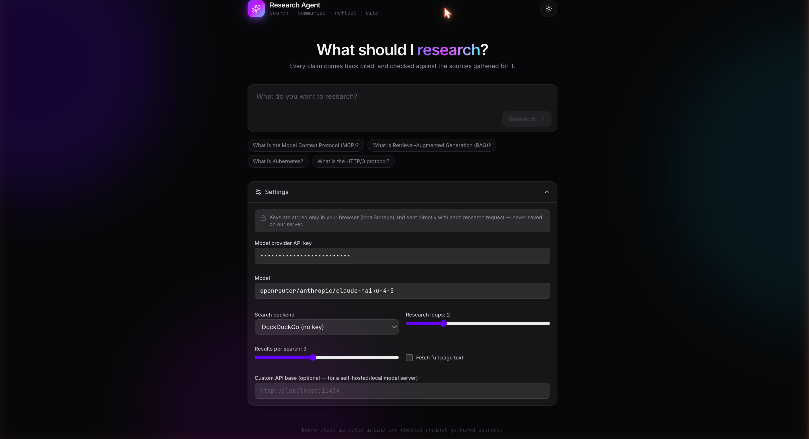
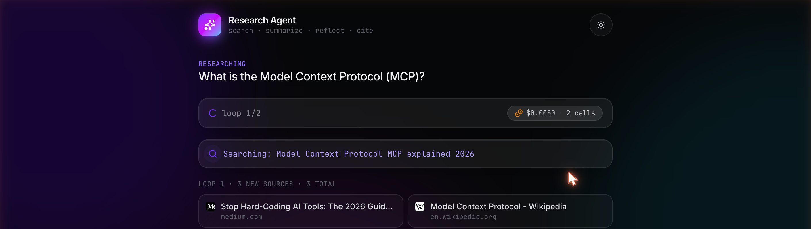
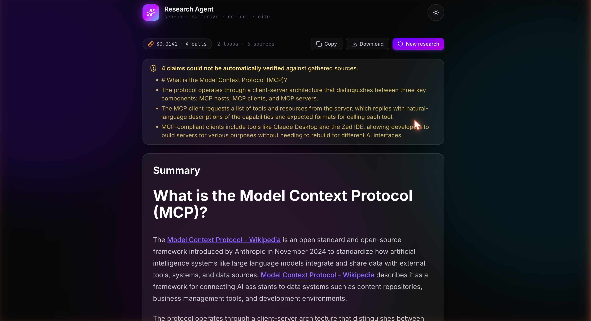

# research-agent

An AI web-research agent: generate a query → search → summarize → reflect → repeat,
then emit a cited markdown report. No orchestration framework — the entire loop is
plain, readable Python, with a quantitative eval harness backing every design decision
below.

Ask 
 

Watch it research 
 

Get a cited, checked report
 

## The result

Scored against **[DeepResearch Bench](https://github.com/Ayanami0730/deep_research_bench)**
— a published 100-task benchmark for deep-research agents — this agent's **citation
accuracy is 91.1%, the highest of any entry on the public leaderboard**, beating Claude,
GPT-4o, Gemini, and Perplexity's dedicated deep-research products. It gets there running
on `claude-haiku-4-5`, a small, cheap model, with no dedicated planning step.

| | RACE overall | Rank (of 46) | Citation accuracy | Rank (of 14 reporting FACT) |
|---|---|---|---|---|
| **research-agent (this project)** | 35.50 | 44th | **91.1%** | **1st** |
| Best RACE overall on the leaderboard | 58.03 | 1st | — | — |
| Best citation accuracy otherwise | 36.63 | 42nd | 87.3% | 2nd |

**What this proves:** citation trustworthiness is a design decision, not a function of
model size or budget. Every claim is cited inline as it's written, then mechanically
checked against the sources actually gathered before the report ships. It does *not*
prove this agent writes the most comprehensive reports — RACE overall lands in the
bottom quartile, the honest cost of a small model with no planning step. Precision and
depth turned out to be separable, and this project optimized the one a good
architecture — not a bigger model — can fix.

<details>
<summary><strong>Full benchmark breakdown, methodology, and internal eval harness</strong></summary>

### DeepResearch Bench, full breakdown

Full run, all 50 English tasks, `openrouter/anthropic/claude-haiku-4-5` + Tavily search,
4 research loops/topic:

| RACE dimension | Score |
|---|---|
| Comprehensiveness | 0.34 |
| Insight | 0.34 |
| Instruction Following | 0.37 |
| Readability | 0.38 |
| **Overall** | **0.36** |

| FACT metric | Value |
|---|---|
| Avg. citations per report | 17.98 |
| Avg. valid citations per report | 16.38 |
| **Citation accuracy** | **91.1%** |

**vs. the [public leaderboard](https://huggingface.co/spaces/muset-ai/DeepResearch-Bench-Leaderboard)**
(same judges as every entry below, so scoring is apples-to-apples; coverage isn't — this
run is 50 English tasks on a small, cheap model, not the full 100-task bilingual set most
entries report):

| | RACE overall | Rank | Citation accuracy | Effective citations |
|---|---|---|---|---|
| sonar-reasoning | 37.75 | 41 | 52.6% | 13.4 |
| claude-3-7-sonnet-with-search | 36.63 | 42 | 87.3% | 24.5 |
| sonar-pro | 36.19 | 43 | 79.7% | 16.8 |
| **research-agent (this project)** | **35.50** | **44 / 46** | **91.1%** | **16.4** |
| gemini-2.5-pro-preview-05-06 | 31.90 | 45 | — | — |
| gpt-4o-search-preview | 30.74 | 46 | 86.6% | 5.1 |

`gemini-2.5-pro-deepresearch` cites ~10x more sources per report than this agent (165 vs.
16), just less accurately (78.3%) — this agent is precise rather than voluminous.

**How the citation accuracy was earned**, not assumed:
- The summarizer cites claims inline as `[Title](URL)` as it writes, not just in a
  trailing bibliography — required because DeepResearch Bench's FACT pipeline only
  extracts citations that appear next to the claim in the body text.
- A citation-grounding check (`research_agent/grounding.py`) verifies every claim's cited
  URL actually matches a source the agent gathered, appending an "Unverified claims"
  footer for anything that doesn't — a deterministic check, not another LLM call.
- Dynamic early-stop reflection lets the loop end before `--loops` is reached once a
  topic is judged sufficiently covered, so loops aren't spent padding a report with
  redundant sources it then has to cite. Confirmed live: 1/5 loops on a trivial factual
  question, 4/4 on a genuinely broad one.

**A tuning path that didn't make the cut:** raising `--loops` and `--max-search-results`
for a stronger model initially made reports *worse* (RACE overall 0.25 vs. 0.38 baseline)
— `max_output_tokens` is a fixed ceiling on every LLM call, so more gathered material just
compressed into the same report length. Full before/after numbers in
[`docs/deepresearch-bench.md`](docs/deepresearch-bench.md), left in rather than
memory-holed.

### Internal eval harness

A faster, cheaper regression signal for day-to-day prompt/model iteration — 6 stable
topics with hand-checked key facts, scored by keyword recall (free) or a second LLM judge:

| Topic | Facts covered | Loops | Sources |
|---|---|---|---|
| What is the Model Context Protocol (MCP)? | 3/3 | 2 | 6 |
| What is Retrieval-Augmented Generation (RAG)? | 2/3 | 2 | 6 |
| What is the Transformer architecture in machine learning? | 3/3 | 2 | 6 |
| What is Kubernetes? | 2/3 | 2 | 6 |
| What is the HTTP/3 protocol? | 3/3 | 2 | 6 |
| What is Rust's ownership model in programming? | 1/3 | 2 | 6 |

**avg fact coverage: 78%** · avg loops: 2.0 · avg sources: 6.0

The harness researches all 6 topics concurrently (`ThreadPoolExecutor`) — a ~2.95x
speedup at concurrency 3 vs. sequential (38.4s vs. 113.3s), close to the theoretical
ceiling for 6 equal-length tasks split across 3 workers.

**124 tests passing**, all mocked at the network boundary — no real network call, ~2s to
run, safe to run constantly.

</details>

```
$ research-agent --topic "What is the Model Context Protocol (MCP)?" \
    --model openrouter/anthropic/claude-haiku-4-5 --search-backend tavily --loops 1

loop 1/1 searched: Model Context Protocol MCP what is  (sources so far: 3)

## Summary
The Model Context Protocol (MCP) is an open standard and open-source framework
introduced by Anthropic in November 2024 designed to standardize how artificial
intelligence systems, particularly large language models (LLMs), integrate with and
access external tools, systems, and data sources...

### Sources:
* Model Context Protocol - Wikipedia : https://en.wikipedia.org/wiki/Model_Context_Protocol
* What is Model Context Protocol (MCP)? : https://www.ibm.com/think/topics/model-context-protocol
* What is MCP? The Universal Connector for AI Explained : https://www.backslash.security/blog/...

2 LLM calls, $0.0040 total cost
```

## Architecture

- **No orchestration framework.** The loop, its state, retries, and structured-output
  parsing are plain Python, readable start to finish.
- **Provider-agnostic.** One model string (`ollama/qwen2.5:7b`, `openai/gpt-4o-mini`,
  `openrouter/anthropic/claude-haiku-4-5`, ...) carries the provider — nothing else
  branches on which one you're using.
- **A minimal `Tool` abstraction** (`research_agent/tools.py`) standardizes what a
  capability the agent loop calls looks like (name, schema, `run()`) without becoming a
  framework itself. Search and a real page-fetch tool both implement it today.
- **Defensive, hardened by live testing.** Bounded retries with corrective feedback on
  malformed output, a fail-loud path when a summary can't be produced, a skip path when
  a search returns nothing.
- **Two explicit research modes.** `iterative` is the original cheap summarize/reflect
  loop. `deep` decomposes the request into a coverage plan, searches multiple gaps per
  round, retains atomic source-grounded evidence, audits it, writes the report once, and
  performs at most one reviewer-directed revision. The modes share the same tools and
  provider interface, so they can be benchmarked directly rather than conflated.
- **Quantitative evaluation, not vibes.** A small internal dataset for fast iteration,
  and DeepResearch Bench for an external, adversarial check.

## Quick start

Requires Python ≥ 3.10 and [uv](https://github.com/astral-sh/uv). You'll also need
either a local model server ([Ollama](https://ollama.com)) or an API key for a hosted
provider (OpenAI, Anthropic, OpenRouter), plus optionally a free
[Tavily](https://tavily.com) key for the more reliable search backend.

```bash
git clone <this-repo-url>
cd research-agent
uv sync --extra dev
cp .env.example .env   # fill in whichever provider/search keys you plan to use
```

```bash
# Local model via Ollama (default) -- no API key needed
uv run research-agent --topic "your research topic" --model ollama/qwen2.5:7b

# Hosted model, real search backend
uv run research-agent --topic "your research topic" \
  --model openrouter/anthropic/claude-haiku-4-5 --search-backend tavily \
  --research-mode deep --fetch-full-page
```

| Flag | Default | Description |
|---|---|---|
| `--topic` | *(required)* | Research topic to investigate |
| `--loops` | `3` | Number of search/summarize/reflect iterations |
| `--model` | `ollama/qwen2.5:7b` | Any [litellm](https://docs.litellm.ai/docs/providers) model string |
| `--api-base` | *(unset)* | Base URL for a local model server; leave unset for hosted providers |
| `--search-backend` | `duckduckgo` | `duckduckgo` (no key) or `tavily` (needs `TAVILY_API_KEY`) |
| `--max-search-results` | `3` | Results fetched per search |
| `--fetch-full-page` | off | Fetch full page text instead of a short search snippet |
| `--research-mode` | `iterative` | `iterative` (cheap loop) or `deep` (plan/evidence/audit/report) |
| `--output` | *(unset)* | Write the final markdown report to this path |
| `--trajectory` | *(unset)* | Write the full run (state + cost) as JSON to this path |

Every `Config` field is also settable via a `RESEARCH_AGENT_<FIELD_NAME>` environment
variable (e.g. `RESEARCH_AGENT_MAX_LOOPS=5`), read from `.env` automatically.

<details>
<summary><strong>Evaluation and DeepResearch Bench commands</strong></summary>

### Evaluation

```bash
# Free, no extra LLM calls -- keyword-overlap heuristic
uv run research-agent-eval --model openrouter/anthropic/claude-haiku-4-5 \
  --search-backend tavily --judge keyword

# More rigorous -- a second model grades the summaries
uv run research-agent-eval --model openrouter/anthropic/claude-haiku-4-5 \
  --search-backend tavily --judge llm --judge-model anthropic/claude-sonnet-5
```

`--judge keyword` scores fact coverage by checking whether enough of a fact's
significant keywords appear in the summary — free, instant, but can't tell a real
paraphrase from coincidental word overlap. `--judge llm` asks a second model (by design,
a different one than `--model`) whether each fact is actually supported.

| Flag | Default | Description |
|---|---|---|
| `--model` | `ollama/qwen2.5:7b` | Model under test |
| `--search-backend` | `duckduckgo` | Search backend to use |
| `--loops` | `2` | Research loops per topic |
| `--judge` | `llm` | `llm` or `keyword` |
| `--judge-model` | `openrouter/anthropic/claude-haiku-4-5` | Model used when `--judge llm` |
| `--concurrency` | `3` | Topics researched in parallel |

### DeepResearch Bench

`research-agent-bench` generates the article JSONL that DeepResearch Bench's own scoring
scripts (RACE + FACT) expect; see [`docs/deepresearch-bench.md`](docs/deepresearch-bench.md)
for the full two-repo workflow. The adapter now selects the new `deep` pipeline. The
published 35.50 RACE / 91.1% FACT result above remains the measured pre-planner baseline
until a new full benchmark run is completed; it is not relabeled after the implementation.

### Tests

```bash
uv run pytest -v
```

</details>

## Web UI

A browser UI wraps the same agent: type a topic, watch sources stream in loop by loop,
and get a rendered, cited report with the citation-grounding check surfaced as a
first-class result — not just a footer. It's a thin FastAPI layer (`api/`) over
`research_agent`'s existing `agent.run()`, streaming progress via Server-Sent Events,
plus a React + Vite + Tailwind frontend (`web/`).

**Bring-your-own-key.** Built to be safely deployable as a public demo: visitors paste
their own model-provider key (and Tavily key, if using that backend) into the browser.
Keys are stored only in `localStorage`, sent directly with each request, and passed
straight through to `litellm`/`TavilyClient` for that one call — never written to a
server-side env var, log, or file. Running it just for yourself locally works the same
way; there's no separate "local mode."

```bash
# Terminal 1 -- API on :8000
uv run uvicorn api.main:app --reload --port 8000

# Terminal 2 -- frontend on :5173
cd web && npm install && npm run dev
```

Open `http://localhost:5173`, add a provider key in Settings, and research something.

<details>
<summary><strong>Production build and Docker</strong></summary>

FastAPI serves the built frontend directly, so a deployment is a single process on a
single port:

```bash
cd web && npm ci && npm run build   # -> web/dist/
cd ..
uv sync                              # now installs fastapi/uvicorn too
uv run uvicorn api.main:app --host 0.0.0.0 --port 8000
```

Or with Docker (multi-stage: `node:20-slim` builds `web/dist`, `python:3.12-slim` serves
both the API and the SPA from one `uvicorn` process):

```bash
docker build -t research-agent .
docker run -p 8000:8000 research-agent
```

Deploy the image anywhere that runs a container (Fly.io, Render, Railway, a bare VPS).
The one thing every deploy target needs to get right: **don't let a reverse proxy buffer
the SSE response** (`X-Accel-Buffering: no` is already set on the API side; a raw Nginx
front additionally needs `proxy_buffering off` on that route), or progress will arrive in
one batch at the end instead of streaming live.

Because it's bring-your-own-key, the deployment itself needs no provider API keys —
`.env` stays relevant only for the CLI/eval tooling above.

</details>

## Project structure

```
research_agent/
├── state.py       # State, plan items, evidence, and sources
├── deep_research.py # Plan -> coverage-driven retrieval -> evidence -> audited report
├── deep_prompts.py  # Structured schemas for planner, extractor, auditor, and reviewer
├── source_quality.py # Deterministic source authority/relevance ranking
├── config.py       # Config -- every runtime knob, env-var resolution
├── llm.py           # LLMClient -- one interface to every model provider
├── search.py         # SearchBackend protocol + DuckDuckGo/Tavily implementations
├── fetch.py            # Full-page fetch + text extraction
├── tools.py             # Tool protocol + registry (search, fetch)
├── grounding.py           # Citation-presence checking for the final report
├── prompts.py               # System prompts + tool schemas for each LLM call
├── agent.py                   # The research loop itself
├── factory.py                   # Shared component wiring for the CLI and eval runner
└── cli.py                         # research-agent entry point

eval/
├── dataset.py       # Topics with checkable key facts
├── judge.py           # KeywordRecallJudge / LLMJudge
├── run_eval.py           # research-agent-eval entry point
└── deepresearch_bench.py   # research-agent-bench entry point

api/                           # FastAPI layer for the web UI
├── schemas.py       # ResearchRequest -- BYOK keys as SecretStr, capped loops/results
├── stream.py          # Runs agent.run() on a thread, bridges progress to SSE
├── routes.py            # POST /api/research
└── main.py                # App factory: CORS, static SPA mount, thread-pool sizing

web/                            # React + Vite + Tailwind frontend
├── src/lib/            # SSE client, localStorage settings/history, event types
├── src/context/          # Settings + theme, persisted to localStorage
├── src/hooks/               # useResearchStream -- owns the active run's SSE lifecycle
└── src/components/             # TopicForm, SettingsDrawer, ResearchProgress, FinalReportView, ...

tests/                       # One test file per module above, all network-mocked
```

## License

MIT — see [LICENSE](LICENSE).
